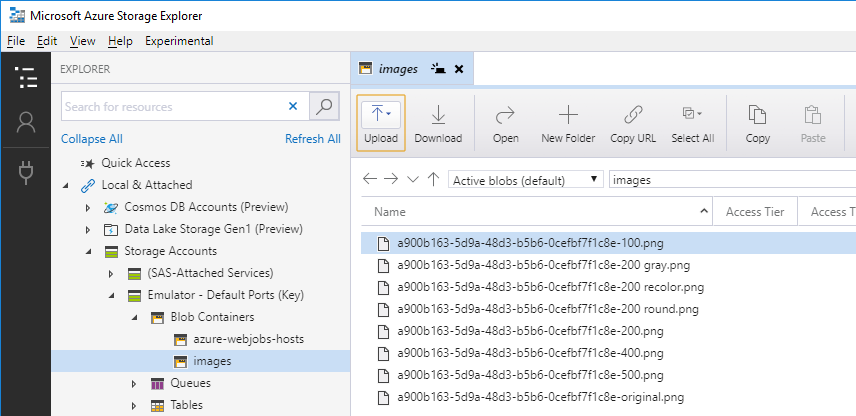

# Azure Functions Lab 

## Lab Part 2: Azure Functions einführen
In diesem Teil wird eine Azure Functions App angelegt und die Berechnungslogik für die Bilder dorthin verlagert. 
Wir benötigen eine Function zum Upload des Bildes, sowie eine weitere zum Abrufen der berechneten Bilder. 

###Schritt 1: Web-Anwendung umstellen

+ In *Startup.cs* wird von *InMemoryImageFileService* auf *FunctionAppImageFileService* umstellen.
Die Web-Anwendung muss beendet, neu gebaut und gestartet werden:

	cd \sdxlab\AzureFunctions\lab1\src.web\SDX.FunctionsDemo.Web
	dotnet build
	dotnet run

Der *FunctionAppImageFileService* verlagert die Verarbeitung, in dem er sie in Web-Requests übersetzt. Die aufgerufenen URLs müssen von der Function App als Endpunkte bereitgestellt werden...

Hinweis: Die Web-Anwendung ist nach wie vor funktionsfähig, meldet jetzt jedoch einen Fehler beim Upload. 

###Schritt 2: Azure Function App erstellen

Unter Windows muss für die lokale Entwickler der Storage Emulator beim gestartet und ggf. initialisiert werden: 

	"C:\Program Files (x86)\Microsoft SDKs\Azure\Storage Emulator\AzureStorageEmulator.exe" init
	"C:\Program Files (x86)\Microsoft SDKs\Azure\Storage Emulator\AzureStorageEmulator.exe" start

>Alternativ bzw. für die Nutzung unter anderen Betriebsystemen muss ein Storage Account in Azure angelegt werden: https://azure.microsoft.com/de-de/services/storage/

VSCode starten:

	cd \sdxlab\AzureFunctions\lab1\src.func
	code .

Im Verzeichnis *\sdxlab\AzureFunctions\lab1\src.func* befinden sich bereits zwei Projekte:

* SDX.FunctionsDemo.ImageProcessing: Das gleiche Projekt, das auch von der Web-Anwendung verwendet wird.
* SDX.FunctionsDemo.FunctionApp.Utils: Einige Hilfsfunktionen für den zu erstellenden Code.

In VSCode sind folgende Buttons relevant:

* Create New Project
* Create Function
* Deploy
* Refresh

Folgende Aktionen ausführen:

* in VSCode: "Create New Project"   
	* Verzeichnis *\sdxlab\AzureFunctions\lab1\src.func\SDX.FunctionsDemo.FunctionApp* anlegen und auswählen
	* Sprache: 			C#
	* Version: 			Azure Functions v2
	* Function Type: 	HttpTrigger
	* Name: 			Ping
	* Namespace:		SDX.FunctionsDemo.FunctionApp
	* Access Rights:	Anonymous

Entweder in VSCode bauen und starten oder auf der Kommandozeile:

	cd \sdxlab\AzureFunctions\lab1\src.func\SDX.FunctionsDemo.FunctionApp
	dotnet build
	func host start

Testen der Function:

	curl http://localhost:7071/api/Ping
	curl http://localhost:7071/api/Ping?name=Alexander

Die erstellte Function zeigt den grundsätzlichen Aufbau:

* Eine statische Funktion mit dem Attribut *[FunctionName("name)]*
* Ein Parameter mit einem Trigger-Attribut, hier *[HttpTrigger(...)]*
	* Der Parametertyp hängt vom Trigger ab.
* Die Function verarbeitet die Eingangsdaten und liefert (je nach Trigger) ein Ergebnis zurück.

> Ja, Azure Functions habne ein *sehr* einfache Programmiermodell. Das ist eine ihrer Stärken!  

TIP: Eine Ping-Funktion sollte immer Teil einer Function App sein, um die grundsätzliche Lauffähigkeit und Erreichbarkeit sicherstellen zu können! 

###Schritt 3: Projektreferenzen setzen

Zunächst müssen Referenzen auf die beiden anderen Projekte gesetzt werden:

	cd \sdxlab\AzureFunctions\lab1\src.func\SDX.FunctionsDemo.FunctionApp
	dotnet add reference ..\SDX.FunctionsDemo.FunctionApp.Utils\SDX.FunctionsDemo.FunctionApp.Utils.csproj
	dotnet add reference ..\SDX.FunctionsDemo.ImageProcessing\SDX.FunctionsDemo.ImageProcessing.csproj
	dotnet build

Die entsprechenden Requests werden in der Web-Anwendung im *FunctionAppImageFileService* zusammengebaut. 

###Schritt 4: Function zum Upload

Die Web-Anwendung nutzt HTTP POST um das Bild zu übertragen und übergibt zusätzliche Informationen als HTTP-Header.

Anlegen der Function:

* in VSCode: "Create Function"
	* Sprache: 			C#
	* Function Type: 	HttpTrigger
	* Name: 			UploadImage
	* Namespace:		SDX.FunctionsDemo.FunctionApp
	* Access Rights:	Anonymous

Folgende using-Direktiven werden benötigt:

	using SDX.FunctionsDemo.FunctionApp.Utils;
	using SDX.FunctionsDemo.ImageProcessing;

Die Function-Method ist anzupassen. Zunächst muss die Information aus dem Request ausgelesen werden:

	string filename = req.Headers["x-sdx-filename"];
	string contentType = req.Headers["x-sdx-contentType"];
	var ms = new MemoryStream();
    req.Body.CopyTo(ms);
    var data = ms.ToArray();

Das Bild muss irgendwo gespeichert werden. Da Azure Functions bereits Storage verwendet, bietet sich die Ablage in Blob Storage an. Projekt *SDX.FunctionsDemo.FunctionApp.Utils* enthält Hilfsfunktionen um den Umgang damit zu vereinfachen.

Erste Hürde ist dabei der Zugriff auf die Konfiguration.
Bei einem Deplyoment in Azure kommt der Connection String aus dem Azure-Portal. Beim lokalen Ausführen steht er in der Datei *local.settings.json*. Key ist *AzureWebJobsStorage*.

Bei Nutzung des Storage Emulators:

	"AzureWebJobsStorage": "UseDevelopmentStorage=true", 

>Bei Nutzung von Storage ein Azure: Der Connection String kann dem Portal entnommen werden:
>
>* Storage Account im Portal auswählen
>* "Settings/Access Keys"
>* "Connection string"  

Die Klasse *ConfigurationHelper* stellt den Zugriff auf die Konfiguartion zur Verfügung. Damit sie das tun kann benötigt sie Zugriff auf die Laufzeitumgebung. Dieser kann ihr gewährt werden, indem die Function eine zusätzlichen Parameter in ihre Parameterliste aufnimmt:

	[FunctionName("UploadImage")]
    public static async Task<IActionResult> Run(
    	[HttpTrigger(AuthorizationLevel.Anonymous, "get", "post", Route = null)] HttpRequest req,
        ExecutionContext context,		// <<-- NEU !!!
        ILogger log)
  
Über den *ExecutionContext* und die angesprochenen Hilffunktionen ist ein Zugriff auf den Blob-Container möglich:

	var container = context
	    .GetConfiguration()
	    .GetStorageAccount()
	    .GetBlobContainer(StorageDefines.Blobs.Images);

Für das Speichern des Orginalbildes wird ein Name benötigt, *BlobNameHelper* hilft, die Namenskonvention einzuhalten:  

    var id = Guid.NewGuid().ToString();
    var blobName = BlobNameHelper.CreateBlobName(id);
    await container.UploadBlobAsync(blobName, data);

Außerdem muss die Berechnungslogik für die übrigen Bilder die Ergebnisse ebenfalls im Blob Storage ablegen:

    foreach (var imageType in ImageUtils.ImageTypes)
    {
        var image = ImageUtils.ProcessImage(data, imageType);
        blobName = BlobNameHelper.CreateBlobName(id, imageType);
        await container.UploadBlobAsync(blobName, image);
		log.LogInformation("Image processed: " + blobName);
    }

>Tip: Ausgaben über den Log-Parameter landen auf der Console und geben einen Überblick über den Verarbeitungsfortschritt.

Abschließend muss die generierte ID als Ergebnis zurückgegeben werden: 

    return new OkObjectResult(id);
 

###Schritt 5: Function zum Download

Die Web-Anwendung nutzt HTTP GET mit der ID und dem ImageType:

	var requestUri = _baseUrl + $"/GetImage?id={id}&imageType={imageType}";

Anlegen der Function:

* in VSCode: "Create Function"
	* Sprache: 			C#
	* Function Type: 	HttpTrigger
	* Name: 			GetImage
	* Namespace:		SDX.FunctionsDemo.FunctionApp
	* Access Rights:	Anonymous

Folgende using-Direktiven werden benötigt:

	using SDX.FunctionsDemo.FunctionApp.Utils;
	using SDX.FunctionsDemo.ImageProcessing;

Die Function-Method ist anzupassen. Der *ExecutionContext* muss wieder ergänzt werden, sowie die Informationen aus dem Request ausgelesen werden:

    [FunctionName("GetImage")]
    public static async Task<IActionResult> Run(
        [HttpTrigger(AuthorizationLevel.Anonymous, "get", "post", Route = null)] HttpRequest req,
        ExecutionContext context,
        ILogger log)
    {
        string id = req.Query["id"];
        string imageType = req.Query["imageType"];

Anhand der ID und des ImageType läßt sich der Blob-Name bestimmen und eine Referenz auf den den Blob ermitten. Ob der Blob tatsächlich existiert muss gesondert geprüft werden:

    var blobName = BlobNameHelper.CreateBlobName(id, imageType);
    var blob = context
        .GetConfiguration()
        .GetStorageAccount()
        .GetBlobContainer(StorageDefines.Blobs.Images)
        .GetBlobReference(blobName);

    var exists = await blob.ExistsAsync();
    if (!exists)
        return new NotFoundObjectResult(blobName);

Das Ergebnis kann einfach als Stream zurückgegeben werden:

    var strm = await blob.OpenReadAsync();
    return new FileStreamResult(strm, ImageUtils.ContentTypePng);

###Schritt 6: Testen

Damit ist die Logik in der Function App umgesetzt. Die Function App muss gestoppt, neu gebaut und gestartet werden. Da in der lokalen Umgebung von Azure Functions immer die gleiche URL verwendet wird, ist die URL in der Web-Anwendung bereits korrekt konfiguriert.  

	cd \sdxlab\AzureFunctions\lab1\src.func\SDX.FunctionsDemo.FunctionApp
	dotnet build
	func host start

Die Umgebung sollte 3 HTTP Functions melden:

Anschließend die Web-Anwendung erneut in Chrome testen.

Ergebnis: Die Anwendung nutzt jetzt die Function (erkennbar an den Ausgaben der Konsole der Function App). 

Mit Hilfe des Storage Explorers kann man sich die Daten anschauen:

Das Zeitverhalten hat sich jedoch nicht nicht geändert, das ist Teil des nächsten Abschnitts.

