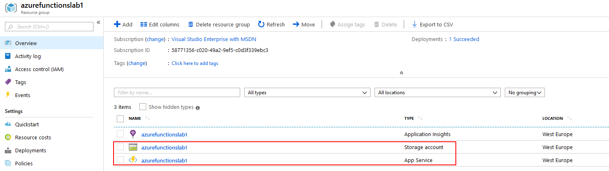

# Azure Functions Lab 

* [Installation](lab1-installation.md): Hinweise zur notwendigen Installation
* [Lab Part 1: Code bereitstellen](lab1-part1.md): Im ersten Teil wird der Lab-Code bereitgestellt, die Testanwendung zum Laufen gebracht und der Code analysiert.
* [Lab Part 2: Azure Functions einführen](lab1-part2.md): In diesem Teil wird eine Azure Functions App angelegt und die Berechnungslogik für die Bilder dorthin verlagert. 
* [Lab Part 3: Azure Functions optimieren](lab1-part3.md): In diesem Teil wird die Verarbeitung durch weitere Functions entkoppelt und parallelisiert.
* [Lab Part 4: Azure Functions in Azure deployen](lab1-part4.md): Im letzten Teil wird die Function App nach Azure deployt.


## Lab Part 4: Azure Functions in Azure deployen

Im letzten Teil wird die Function App nach Azure deployt.

Die Function App sollte dabei im Azure Portal angelegt werden. 

>Zwar geht dies auch aus VSCode heraus, dabeikönnen jedoch bestimmte Dinge nicht vorgegeben werden, z.B. die Region.

### Schritt 1: Anlegen der Function App im Azure Portal

Hierzu sind folgende Schritte im Azure Portal notwendig: https://portal.azure.com

* Ggf. die korrekte Subscription auswählen

* Eine neue *Resource group* anlegen
	* Beispiel für den Namen: azurefunctionslab1
	* Region: "West Europe" 

	>Eine *Resource group* kann nach Beendingung des Labs mit allen enthalten Resourcen in einem Rutsch wieder gelöscht werden. 

* Anlegen einer neuen Function App:
	* "Create resource", "Function App" suchen und auswählen:

		

	* Die Function sauber parametrisieren:  
		* Der "App name" muss global eindeutig sein
		* Bei "Resource Group" muss die gerade angelegt *Resource Group* ausgewählt werden.
		* "Hosting Plan" = "Consumption Plan" stellt sicher, dass die Functions nach Verbrauch abgerechnet werden.
		* Location: "West Europe" 
		
		
	 
>Hinweis: Das Anlegen der Function App kann gelegentlich mehr Zeit in Anspruch nehmen, als auf den ersten Blick erkennbar. 

Danach sollten mindestens die Function App (als "App Service", am Icon erkennbar) und ein Storage Account verfügbar sein:



Nach Auswahl der Function App kann unter "Overview" die URL ermittelt werden, in diesem Fall https://azurefunctionslab1.azurewebsites.net 


### Schritt 2: Anpassen der Web-Anwendung

In der Web-Anwendung muss die URL der Function App von der lokalen Umgebung auf die neue Function App in Azure geändert werden.

	cd \sdxlab\AzureFunctions\lab1\src.web
	code .

Im Projekt *SDX.FunctionsDemo.Web* die Datei *appsettings.json* öffnen und die URL ändern:

```JSON
    "Settings": {
        "FunctionApp.Url": "https://azurefunctionslab1.azurewebsites.net"
    }
```

```JavaScript
    "Settings": {
        "FunctionApp.Url": "https://azurefunctionslab1.azurewebsites.net"
    }
```

Danach die Web-Anwendung beenden, und neu starten:

	cd \sdxlab\AzureFunctions\lab1\src.web\SDX.FunctionsDemo.Web
	dotnet run
 
Ein neuer Test führt wieder zu Fehlermeldungen, weil die Function App in Azure noch nichts tut. 

Hinweis: Zur Sicherheit sollte die lokal laufende Function App beendet werden. 


### Schritt 3: Deployment der Function App

Das Function App Projekt in VSCode öffnen:

	cd \sdxlab\AzureFunctions\lab1\src.func
	code .

Das Deployment kann folgendermaßen durchgeführt werden:

* Im Explorer den Eintrag "SDX.FunctionsDemo.FunctionApp" selektieren, Kontextmenü, Eintrag "Deploy to Function App..." auswählen
	
* Die gerade angelegte Function App *azurefunctionslab1* als Ziel auswählen  
* Das Deployment bestätigen
* Das Deployment benötigt einen Moment...

Im Portal können die Functions eingesehen werden. 


### Schritt 4: Test der Anwendung

Um die Verarbeitung der Functions sichtbar zu machen, ist es sinnvoll, Zugriff auf die Logs zu erhalten. Dies ist im Azure Portal möglich, oder auch in VSCode:


Die Lauffähigkeit der Function App läßt sich mit CURL verifizieren:

	CURL https://azurefunctionslab1.azurewebsites.net/api/ping

Ein neuer Test im Browser zeigt die Funktionsfähigkeit. 
