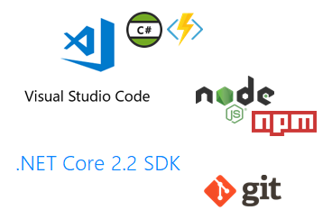

# Azure Functions Lab 

## Installation

Das Lab verwendet Visual Studio Code (VSCode) um auf Code-Ebene plattformunabhägig zu sein. Nutzer von Visual Studio Code finden unten zusätzliche Hinweise.

### Installation:

* Visual Studio Code:	
	* Installer: https://code.visualstudio.com/
	* C# for Visual Studio Code:	
		* https://marketplace.visualstudio.com/itemdetails?itemName=ms-vscode.csharp
	* Azure Functions for Visual Studio Code: 
		* https://marketplace.visualstudio.com/itemdetails?itemName=ms-azuretools.vscode-azurefunctions 
		* oder in VSCode: vscode:extension/ms-azuretools.vscode-azurefunctions
* Azure Functions Core Tools:
	* enthält:
		* .NET Core 2.x SDK 
		* Node.js (inkl. npm)
		* Core Tools package
	* https://docs.microsoft.com/en-us/azure/azure-functions/functions-run-local#v2
* GIT: 
	* Installer: https://git-scm.com/downloads

Bei Problemen sollte die Dokumentation weiterhelfen können: https://docs.microsoft.com/en-us/azure/azure-functions/functions-create-first-function-vs-code#prerequisites

### Azure Storage Emulator:

Für Windows steht der Azure Storage Emulator als Teil des Azure SDK zu Verfügung: https://docs.microsoft.com/en-us/azure/storage/common/storage-use-emulator#get-the-storage-emulator

Unter anderen Betriebsystemen muss in Azure ein Storage Account angelegt werden: https://azure.microsoft.com/de-de/services/storage/

> Alternativ gibt es eine Open Source-Variante:
>
>>A lightweight server clone of Azure Storage that simulates most of the commands supported by it with minimal dependencies
>
> https://github.com/azure/azurite
>
> Getestet unter Ubuntu 18.04, unter MacOS mit Problemen.

### Optional:

* Azure Storage Explorer:	
	* https://azure.microsoft.com/en-us/features/storage-explorer/
* Postman, curl, oder vergleichbar.

### Visual Studio 2017/2019-Nutzer
Die Nutzung von Visual Studio 2017/2019 ist ebenfalls möglich und sollte wenig Probleme bereiten. 
Notwendige Informationen zur Installation finden sich hier: https://docs.microsoft.com/en-us/azure/azure-functions/functions-create-your-first-function-visual-studio

---
[Inhalte](lab1.md#lab-inhalte) | [Weiter »](lab1-part1.md)
