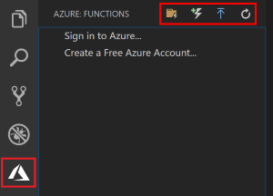
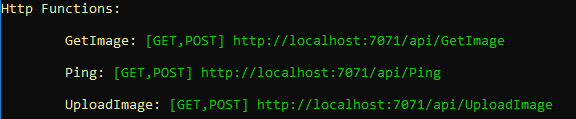
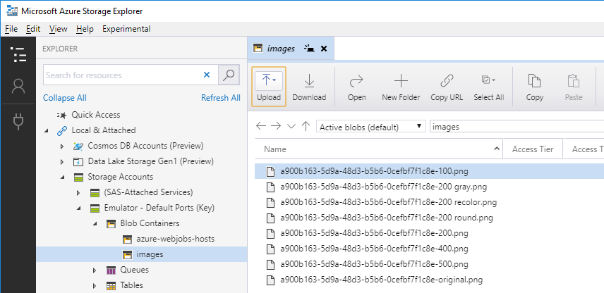

# Azure Functions Lab 

## Inhaltsverzeichnis
* [Lab-Übersicht](lab1.md)
	* [Installation](lab1-installation.md)
	* [Lab Part 1: Code bereitstellen](lab1-part1.md)
	* [Lab Part 2: Azure Functions einführen](lab1-part2.md)
	* [Lab Part 3: Azure Functions optimieren](lab1-part3.md)
	* [Lab Part 4: Azure Functions in Azure deployen](lab1-part4.md)


## Lab Part 2: Azure Functions einführen
In diesem Teil wird eine Azure Functions App angelegt und die Berechnungslogik für die Bilder dorthin verlagert. 
Wir benötigen eine Function zum Upload des Bildes, sowie eine weitere zum Abrufen der berechneten Bilder. 


### Schritt 1: Web-Anwendung umstellen

Folgende Schritte sind notwendig:

* In `Startup.cs` von `InMemoryImageFileService` auf `FunctionAppImageFileService` umstellen.

Anschließend die Web-Anwendung beenden, neu bauen und starten:

	cd /sdxlab/AzureFunctions/lab1/src.web/SDX.FunctionsDemo.Web
	dotnet build
	dotnet run

Der `FunctionAppImageFileService` verlagert die Verarbeitung, in dem er sie in Web-Requests übersetzt. Die aufgerufenen URLs müssen von der Function App als Endpunkte bereitgestellt werden (Aufgabe im nächsten Schritt).

Hinweis: Die Web-Anwendung ist nach wie vor funktionsfähig, meldet jetzt jedoch einen Fehler beim Upload. 


### Zwischenschritt: Storage verfügbar machen

#### Windows
Unter Windows muss für die lokale Entwickler der Storage Emulator gestartet und ggf. vorher initialisiert werden: 

	"C:\Program Files (x86)\Microsoft SDKs\Azure\Storage Emulator\AzureStorageEmulator.exe" init
	"C:\Program Files (x86)\Microsoft SDKs\Azure\Storage Emulator\AzureStorageEmulator.exe" start

>Hinweis: Bei Nutzung von Visual Studio wird der Storage Emulator automatisch gestartet. 

#### Alternativ/andere Betriebssysteme: Storage Account

Alternativ bzw. für die Nutzung unter anderen Betriebsystemen kann ein Storage Account in Azure angelegt werden: 

* https://azure.microsoft.com/de-de/services/storage/


#### Andere OS: Azurite

Alternativ gibt es eine Open Source-Variante:

>A lightweight server clone of Azure Storage that simulates most of the commands supported by it with minimal dependencies

* https://github.com/azure/azurite

>Hinweis: Getestet unter Ubuntu 18.04, unter MacOS mit Problemen.


### Schritt 2: Azure Function App erstellen

VSCode starten:

	cd /sdxlab/AzureFunctions/lab1/src.func
	code .

Im Verzeichnis `/sdxlab/AzureFunctions/lab1/src.func` befinden sich bereits zwei Projekte:

* `SDX.FunctionsDemo.ImageProcessing`: Das gleiche Projekt, das auch von der Web-Anwendung verwendet wird.
* `SDX.FunctionsDemo.FunctionApp.Utils`: Einige Hilfsfunktionen für den zu erstellenden Code.

In VSCode sind folgende Buttons relevant:

* Create New Project
* Create Function
* Deploy
* Refresh




Folgende Aktionen ausführen:

* in VSCode: "Create New Project"   
	* Verzeichnis `/sdxlab/AzureFunctions/lab1/src.func/SDX.FunctionsDemo.FunctionApp` anlegen und auswählen
	* Sprache: 			`C#`
	* Version: 			`Azure Functions v2`
	* Function Type: 	`HttpTrigger`
	* Name: 			`Ping`
	* Namespace:		`SDX.FunctionsDemo.FunctionApp`
	* Access Rights:	`Anonymous`


Die Function App kann in VSCode gebaut und gestartet werden, die nachfolgende Beschreibung nutzt jedooch die Kommandozeile. 
>Da die Konsole danach blockiert ist, wird empfohlen, eine separate Konsole zu starten.

	cd /sdxlab/AzureFunctions/lab1/src.func/SDX.FunctionsDemo.FunctionApp
	dotnet build
	func host start

Testen der Function:

	curl http://localhost:7071/api/Ping
	curl http://localhost:7071/api/Ping?name=Alexander

Die erstellte Function zeigt den grundsätzlichen Aufbau einer Function App Function:

* Eine statische Funktion mit dem Attribut `[FunctionName("name)]`
* Ein Parameter mit einem Trigger-Attribut, hier `[HttpTrigger(...)]`
	* Der Parametertyp hängt vom Trigger ab.
* Die Function verarbeitet die Eingangsdaten und liefert (je nach Trigger) ein Ergebnis zurück.

> Ja, Azure Functions haben ein *sehr* einfaches Programmiermodell. *Das ist eine ihrer Stärken!*  

TIP: Eine Ping-Funktion sollte immer Teil einer Function App sein, um die grundsätzliche Lauffähigkeit und Erreichbarkeit sicherstellen zu können! 


### Schritt 3: Projekt-Konfiguration

Zunächst müssen Referenzen auf die beiden anderen Projekte gesetzt werden:

	cd /sdxlab/AzureFunctions/lab1/src.func/SDX.FunctionsDemo.FunctionApp
	dotnet add reference ../SDX.FunctionsDemo.FunctionApp.Utils/SDX.FunctionsDemo.FunctionApp.Utils.csproj
	dotnet add reference ../SDX.FunctionsDemo.ImageProcessing/SDX.FunctionsDemo.ImageProcessing.csproj


Als nächstes muss der Connection String konfiguriert werden. Bei lokaler Ausführung steht der Connection String in der Datei `local.settings.json`, beim späteren einem Deplyoment in Azure kommt er aus dem Azure-Portal.
 
Key ist standardmäßig `AzureWebJobsStorage`, bei Nutzung des Storage Emulators lautet der Connection String `UseDevelopmentStorage=true`:

```JavaScript
"AzureWebJobsStorage": "UseDevelopmentStorage=true", 
```

Bei Nutzung von Storage ein Azure: Der Connection String kann dem Portal entnommen werden:

* Storage Account im Portal auswählen
* "Settings/Access Keys"
* "Connection string"  


### Schritt 4: Function zum Upload

Die Web-Anwendung nutzt HTTP POST um das Bild zu übertragen und übergibt zusätzliche Informationen als HTTP-Header.
Der entsprechende Request wird in der Web-Anwendung im `FunctionAppImageFileService` zusammengebaut. 

Anlegen der Function:

* in VSCode: "Create Function"
	* Sprache: 			`C#`
	* Function Type: 	`HttpTrigger`
	* Name: 			`UploadImage`
	* Namespace:		`SDX.FunctionsDemo.FunctionApp`
	* Access Rights:	`Anonymous`

Folgende `using`-Direktiven werden benötigt:

```CSharp
using SDX.FunctionsDemo.FunctionApp.Utils;
using SDX.FunctionsDemo.ImageProcessing;
```

Die Function-Methode ist anzupassen. Der gesamte Funktionsrumpf kann gelöscht werden. Danach die Information aus dem Request ausgelesen werden:

```CSharp
string fileName = req.Headers["x-sdx-fileName"];
string contentType = req.Headers["x-sdx-contentType"];
var ms = new MemoryStream();
req.Body.CopyTo(ms);
var data = ms.ToArray();
```

Das Bild muss irgendwo gespeichert werden. Da Azure Functions bereits Azure Storage verwendet, bietet sich die Ablage in Blob Storage an. Projekt `SDX.FunctionsDemo.FunctionApp.Utils` enthält Hilfsfunktionen um den Umgang damit zu vereinfachen.

Erste Hürde ist dabei der Zugriff auf die Konfiguration. Die Klasse `ConfigurationHelper` stellt den Zugriff darauf Verfügung, benötigt dafür jedoch Zugriff auf die Laufzeitumgebung. Dieser kann ihr gewährt werden, indem die Function einen zusätzlichen Parameter vom Typ `ExecutionContext` in ihre Parameterliste aufnimmt:

```CSharp
[FunctionName("UploadImage")]
public static async Task<IActionResult> Run(
    [HttpTrigger(AuthorizationLevel.Anonymous, "get", "post", Route = null)] HttpRequest req,
    ExecutionContext context,		// <<-- NEU !!!
    ILogger log)
```
  
Über den `ExecutionContext` und die angesprochenen Hilfsfunktionen ist ein Zugriff auf den Blob-Container möglich:

```CSharp
var container = context
    .GetConfiguration()
    .GetStorageAccount()
    .GetBlobContainer(StorageDefines.Blobs.Images);
```

Für das Speichern des Orginalbildes wird eine neue ID und ein Name benötigt; `BlobNameHelper` hilft, die Namenskonventionen einzuhalten:  

```CSharp
var id = Guid.NewGuid().ToString();
var blobName = BlobNameHelper.CreateBlobName(id);
await container.UploadBlobAsync(blobName, data);
```

Die erwarteten Bilder müssen berechnet und ebenfalls im Blob Storage abgelegt werden:

```CSharp
foreach (var imageType in ImageUtils.ImageTypes)
{
    var image = ImageUtils.ProcessImage(data, imageType, fileName);
    blobName = BlobNameHelper.CreateBlobName(id, imageType);
    await container.UploadBlobAsync(blobName, image);
    log.LogInformation("Image processed: " + blobName);
}
```

>Tip: Ausgaben über den `log`-Parameter landen auf der Console und machen so den Verarbeitungsfortschritt nachvollziehbar.

Abschließend muss die generierte ID als Ergebnis zurückgegeben werden: 

```CSharp
return new OkObjectResult(id);
``` 


### Schritt 5: Function zum Download

Die Web-Anwendung nutzt HTTP GET mit der ID und dem ImageType.
Der entsprechende Request wird in der Web-Anwendung im `FunctionAppImageFileService` zusammengebaut.

```CSharp
var requestUri = _baseUrl + $"/GetImage?id={id}&imageType={imageType}";
```

Anlegen der Function:

* in VSCode: "Create Function"
	* Sprache: 			`C#`
	* Function Type: 	`HttpTrigger`
	* Name: 			`GetImage`
	* Namespace:		`SDX.FunctionsDemo.FunctionApp`
	* Access Rights:	`Anonymous`

Folgende `using`-Direktiven werden benötigt:

```CSharp
using SDX.FunctionsDemo.FunctionApp.Utils;
using SDX.FunctionsDemo.ImageProcessing;
```

Die Function-Methode ist anzupassen. Der gesamte Funktionsrumpf kann gelöscht werden. Außerdem muss der `ExecutionContext` wieder ergänzt werden:

```CSharp
[FunctionName("GetImage")]
public static async Task<IActionResult> Run(
    [HttpTrigger(AuthorizationLevel.Anonymous, "get", "post", Route = null)] HttpRequest req,
    ExecutionContext context,		// <<-- NEU !!!
    ILogger log)
{
```

Anhand der übergebenen ID und des ImageType läßt sich der Blob-Name bestimmen und eine Referenz auf den Blob ermitten. Ob der Blob tatsächlich existiert muss gesondert geprüft werden:

```CSharp
string id = req.Query["id"];
string imageType = req.Query["imageType"];
var blobName = BlobNameHelper.CreateBlobName(id, imageType);
var blob = context
    .GetConfiguration()
    .GetStorageAccount()
    .GetBlobContainer(StorageDefines.Blobs.Images)
    .GetBlobReference(blobName);

var exists = await blob.ExistsAsync();
if (!exists)
    return new NotFoundObjectResult(blobName);
```

Das Ergebnis kann als Stream zurückgegeben werden:

```CSharp
var strm = await blob.OpenReadAsync();
return new FileStreamResult(strm, ImageUtils.ContentTypePng);
```


### Schritt 6: Testen

Damit ist die Logik in der Function App umgesetzt. Die Function App muss gestoppt, neu gebaut und gestartet werden. Da in der lokalen Umgebung von Azure Functions immer die gleiche URL verwendet wird, ist die URL in der Web-Anwendung bereits korrekt konfiguriert.  

	cd /sdxlab/AzureFunctions/lab1/src.func/SDX.FunctionsDemo.FunctionApp
	dotnet build
	func host start

Die Umgebung sollte 3 HTTP Functions melden:



Anschließend kann die Web-Anwendung erneut im Browser getestet werden.

Ergebnis: Die Anwendung nutzt jetzt die Function (erkennbar an den Ausgaben der Konsole der Function App). 

Mit Hilfe des Storage Explorers kann man sich die Daten nach einem Upload anschauen:



Das Zeitverhalten hat sich jedoch nicht geändert, da die Berechnungslogik lediglich in die Function verschoben, aber nicht grundsätzlich geändert wurde. Dies ist Teil des nächsten Abschnitts.


