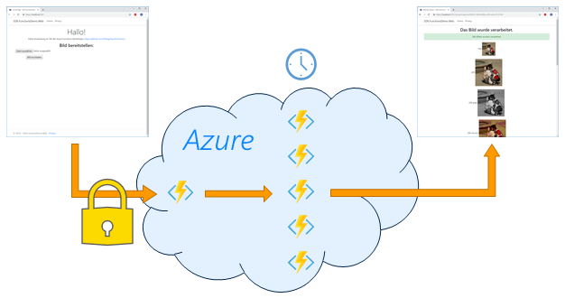

# Azure Functions Lab 

## Lab Part 5: Azure Functions absichern



Die in Azure verfügbaren HTTP Functions sind offen und für jeden erreichbar. In diesem Teil werden sie gegen unberechtigten Zugriff abgesichert.


### Schritt 1: Anpassen der HTTP Functions

Bei den beiden HTTP Functions `UploadImage` und `GetImage` muss der AuthorizationLevel auf `AuthorizationLevel.Function` geändert werden: 


Damit wird erreicht, dass jede Function nur mit Angabe eines Function Keys angesprochen werden kann. 
> `AuthorizationLevel.Admin` hätte einen ähnlichen Effekt, nur dass der Master Key verwendet wird. Die übrigen Werte werde werden derzeit nicht unterstützt.

Danach muss die Function App übersetzt und neu deployt werden. Testet man die Web-Anwendung anschließend, erhält man wieder Fehler beim Upload.

Hinweis: Läßt man die Function App lokal laufen, werden die Function Keys ignoriert.


### Schritt 2: Anpassen der Web-Anwendung

In der Web-Anwendung muss bei ihren Aufrufen die entsprechenden Function Keys mit übergeben.
Die Function Keys lassen sich dem Azure Portal entnehmen:


Diese werden in der Web-Anwendung in den `appsettings.json` hinterlegt:

```JavaScript
"Settings": {
    "FunctionApp.Url": "...",
    // neu: Function Keys aus dem Azure Portal... 
    "FunctionApp.Keys": {
        "UploadImage": "C83OAz7aePDb242gx0324CEy49gLVaJDG4w88nFJTmLk1aWanV5p9g==",
        "GetImage": "O0DZ1nLD2aUsPVl84jfaEdy1Y6WQxfKya518HzaYl8RnSkxKdebjXg=="
    }
}
```

Beim Aufbau der Web-Requests in der Klasse `Services.FunctionAppImageFileService` muss der jeweilige Function Key im Request mit übergeben werden. 

In der Funktion `UploadImageAsync` ist die relativ einfach: Da es bereits ein `HttpContent`-Objekt gibt, muss nur der vorgegebene Header gesetzt werden:

```CSharp
// Neu: functionsKey setzen
var functionsKey = _configuration["Settings:FunctionApp.Keys:UploadImage"];
content.Headers.Add("x-functions-key", functionsKey);
```

In der Funktion `GetImageAsync` gibt wird bisher eine einfache `HttpClient.GetAsync`-Methode verwendet. Um den Header zu setzen wird ein `HttpRequest`-Objekt benötigt, daher muss der Aufruf umgebaut werden:

```CSharp
// ALT:
// var response = await _client.GetAsync(requestUri);

// Neu: functionsKey setzen
var request = new HttpRequestMessage(HttpMethod.Get, requestUri);
var functionsKey = _configuration["Settings:FunctionApp.Keys:UploadImage"];
request.Headers.Add("x-functions-key", functionsKey);
var response = await _client.SendAsync(request);
```


Danach die Web-Anwendung beenden, neu bauen und starten:

	cd /sdxlab/AzureFunctions/lab1/src.web/SDX.FunctionsDemo.Web
	dotnet build
	dotnet run
 

Ein neuer Test im Browser zeigt, dass die Funktionsfähigkeit wieder hergestellt ist. 

Ruft man hingegen eine der beiden URLs auf (z.B. in Postman), ohne den passenden Function Key mit zu übergeben, erhält man als Antwort ein `401 Unauthorized`.

---
[« Zurück](lab1-part4.md) | [Inhalte](lab1.md#lab-inhalte) 
