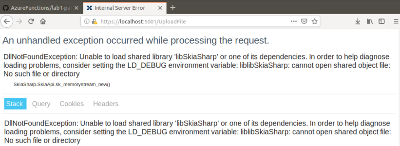

# Azure Functions Lab 

Dieses Lab soll den ersten Einstieg in Azure Functions bieten.

### Motivation
Die Dokumentation von Microsoft bietet einen Einstige in Azure Functions auf rein technischer Ebene. In diesem Lab wurde Wert darauf gelegt, dass der Einsatz im Rahmen eines wenn auch vereinfachten, aber doch nachvollziehbaren Use Cases stattfindet.

In einer Web-Anwendung können Bilder hochgeladen werden, die dann auf verschiedene Arten aufbereitet werden (unterschiedliche Größen, Filtereffekte, runder Ausschnitt):

Die Verarbeitung der Bilder dauert entsprechend lange und soll deshalb in eine Azure Function verlagert werden.

>Hinweis: Um den Effekt deutlich zu machen, wurde die Berechnung künstlich verlängert.

## Voraussetzungen

Kenntnisse von C# werden vorausgesetzt. Kenntnisse von ASP.NET MVC sind von Vorteil. 

Es wird ein Azure-Konto benötigt. Fall kein Konto verfügbar ist, kann ein kostenloses Azure-Konto angelegt werden: 

* https://azure.microsoft.com/de-de/free/
* https://azure.microsoft.com/de-de/free/students/

Zur Notwendigkeit eines Azure-Kontos:

* Unter Windows: Der Account wird ab Lab4 (Azure Deployment) benötigt, die Entwicklung für Lab1 bis Lab3 ist lokal möglich.
* Unter anderen Betriebssystemen: Der Account wird auch für die Entwicklung benöigt, da es keinen Storage Emulator gibt.
	> Mögliche Alternative: https://github.com/azure/azurite
	> 
	> Getestet unter Ubuntu 18.04, unter MacOS mit Problemen

## Hinweise

* Das Lab verwendet Visual Studio Code (VSCode) um auf Code-Ebene plattformunabhägig zu sein. 
* Das Lab wurde unter Windows entwickelt; auf anderen Plattformen kann es zu Detailunterschieden kommen.
* Das Lab wurde unter MacOS und Ubuntu 18.04 getestet.
* Pfade sind in Windows-Notation angegeben und müssen unter Unix-Derivaten um das Home-Verzeichnis ergänzt werden:
	* Windows: `/sdxlab/` bzw. `cd /`
	* Unix-Derivat: `~/sdxlab/` bzw. `cd ~`

## Lab-Inhalte

* [Installation](lab1-installation.md): Hinweise zur notwendigen Installation
* [Lab Part 1: Code bereitstellen](lab1-part1.md): Im ersten Teil wird der Lab-Code bereitgestellt, die Testanwendung zum Laufen gebracht und der Code analysiert.
* [Lab Part 2: Azure Functions einführen](lab1-part2.md): In diesem Teil wird eine Azure Functions App angelegt und die Berechnungslogik für die Bilder dorthin verlagert. 
* [Lab Part 3: Azure Functions optimieren](lab1-part3.md): In diesem Teil wird die Verarbeitung durch weitere Functions entkoppelt und parallelisiert.
* [Lab Part 4: Azure Functions in Azure deployen](lab1-part4.md): In diesem Teil wird die Function App nach Azure deployt.
* [Lab Part 5: Azure Functions absichern](lab1-part5.md): Die in Azure verfügbaren HTTP Functions sind offen und für jeden erreichbar. In diesem Teil werden sie gegen unberechtigten Zugriff abgesichert.

## Caveat
Die Anwendung nutzt [SkiaSharp](https://github.com/mono/SkiaSharp) als plattformunabhängige Bibliothek für Bildverarbeitung.

Sowohl unter MacOS X, als auch unter Ubuntu 18.04 kommt es dabei zu folgender Fehlermeldung: 

Der Lab-Code ist so angepaßt, dass auf Nicht-Windows-Systemen eine simulierte Bildberechnung verwendet wird: Die Beispielbilder werden vorberechnet mit ausgeliefert.

# Links
* SDX AG
	* https://www.sdx-ag.de
	* https://www.sdx-ag.de/?s=azure+functions
	* https://www.sdx-ag.de/2019/03/azure-functions-eine-kurze-einfhrung/##news_content
* Microsoft
	* https://azure.microsoft.com/de-de/services/functions/
	* https://docs.microsoft.com/en-us/azure/azure-functions/functions-create-first-function-vs-code

